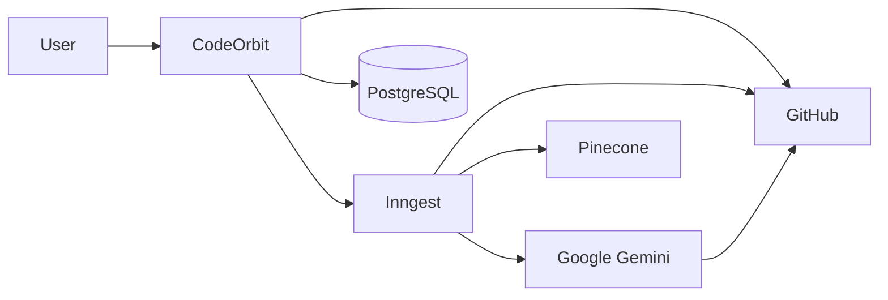
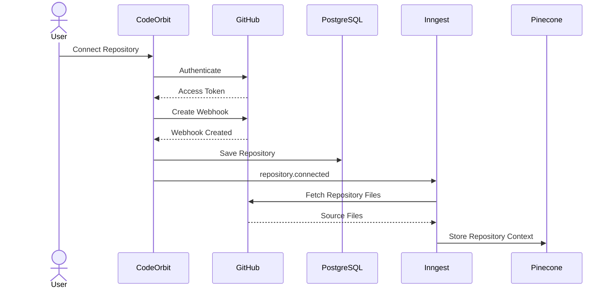
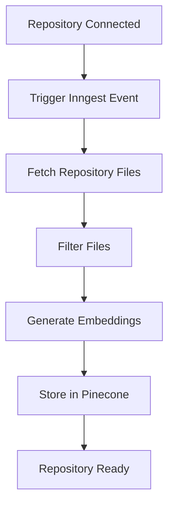
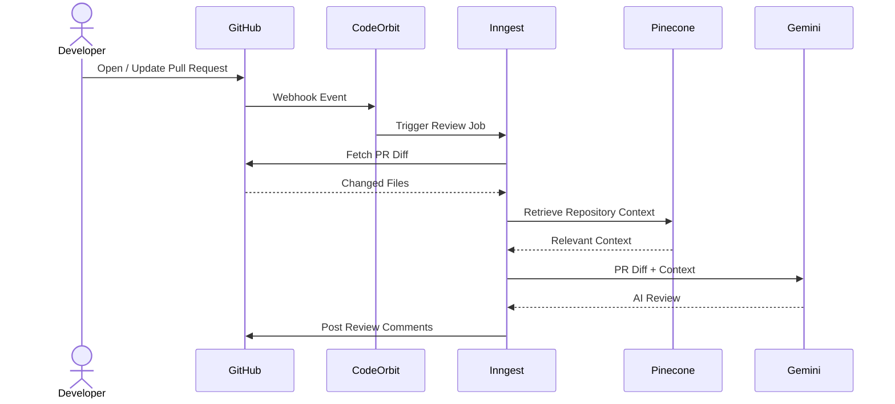
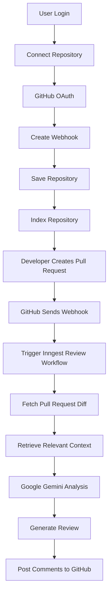

# 🚀 CodeOrbit – AI-Powered GitHub Code Review Platform

CodeOrbit is an AI-powered GitHub code review platform that automates Pull Request reviews using Google Gemini. It integrates with GitHub using webhooks, indexes repositories in the background, retrieves relevant code context, and posts intelligent review comments directly on GitHub Pull Requests.

---

## ✨ Features

- 🔐 GitHub Authentication
- 📂 Connect GitHub Repositories
- 🔗 Automatic GitHub Webhook Integration
- 🤖 AI-powered Pull Request Reviews
- 🧠 Context-aware Code Analysis
- ⚡ Background Repository Indexing
- 💬 Automatic GitHub Review Comments
- 📊 Repository Dashboard
- 🔄 Retry-safe Background Processing with Inngest
- 🗄️ PostgreSQL Database using Prisma ORM

---

# 🛠 Tech Stack

### Frontend

- Next.js 16
- React 19
- TypeScript
- Tailwind CSS
- shadcn/ui

### Backend

- Next.js API Routes
- Prisma ORM
- PostgreSQL (Neon)
- Inngest
- Octokit

### AI

- Google Gemini
- Pinecone Vector Database

### Authentication

- Better Auth

---

# 🏗 System Architecture



---

# 🔄 Repository Connection Flow



---

# ⚡ Repository Indexing Workflow



---

# 🤖 Pull Request Review Workflow



---

# 🚀 Complete Workflow



---

# 📂 Project Structure

```text
src
│
├── app
│   ├── api
│   ├── dashboard
│   ├── login
│   └── settings
│
├── actions
├── components
├── inngest
├── lib
├── modules
│   ├── ai
│   ├── auth
│   ├── github
│   ├── repository
│   ├── review
│   ├── payment
│   └── settings
│
├── prisma
└── types
```

---

# ⚙ How It Works

### 1. Connect Repository

- Authenticate with GitHub.
- Select a repository.
- Create a GitHub webhook.
- Store repository information in PostgreSQL.

### 2. Repository Indexing

- Trigger an Inngest background workflow.
- Fetch repository source code.
- Process supported files.
- Generate vector embeddings.
- Store repository context in Pinecone.

### 3. Pull Request Review

- Developer opens or updates a Pull Request.
- GitHub sends a webhook event.
- Inngest starts the review workflow.
- Fetch the Pull Request diff.
- Retrieve relevant repository context.
- Google Gemini analyzes the changes.
- AI-generated review comments are posted back to GitHub.

---

# 🚀 Getting Started

```bash
git clone https://github.com/your-username/codeorbit.git

cd codeorbit

npm install

npm run dev
```

---

# 🔑 Environment Variables

```env
DATABASE_URL=

GITHUB_CLIENT_ID=
GITHUB_CLIENT_SECRET=

GEMINI_API_KEY=

BETTER_AUTH_SECRET=

PINECONE_API_KEY=

INNGEST_EVENT_KEY=

NEXT_PUBLIC_APP_URL=
```

---

---

# 👨‍💻 Author

**Abhishek Yadav**

Final Year B.Tech CSE Student  
Full Stack Developer | MERN | AI | Competitive Programmer
